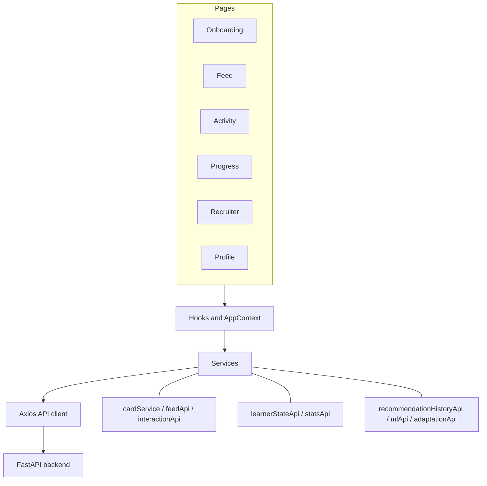

# Vinayoki Frontend

> An adaptive learning interface that turns attention into measurable progress.

Vinayoki presents short, structured learning activities and adapts recommendations using the learner's profile, interactions, and progress. This repository contains the React application; recommendation and learner-state calculations are served by the FastAPI backend.

## Screenshots

Add current product screenshots here. Suggested captures: onboarding, personalized feed, a Watch/Solve/Build activity, Progress, and the recruiter/demo view. Screenshots should represent the deployed UI and use consented demo data.

## Architecture



The main pages are `Welcome`, `Onboarding`, `Feed`, `Activity`, `Result`, `Progress`, `SkillDetail`, `Profile`, and `RecruiterDashboard`. `AppContext` keeps the current user/profile and selected card; hooks coordinate page-level loading and services own HTTP calls. `cardService.ts` normalizes the current card API and legacy activity-feed response for the UI.

## Stack

| Area | Implementation |
| --- | --- |
| UI | React 19, TypeScript |
| Build and dev server | Vite 8 |
| Routing | React Router 7 |
| HTTP | Axios |
| Charts and motion | Recharts, Framer Motion |
| Icons and notifications | Lucide React, Sonner |
| Styling | Tailwind CSS utilities and project CSS |

## Project structure

```text
src/
├── components/     Reusable UI and Watch/Solve/Build steps
├── context/        AppContext and browser-persisted learner identity
├── hooks/          Feed, learner-state, history, and snapshot loading
├── pages/          Onboarding, learning, progress, profile, recruiter view
├── services/       Axios client and typed backend API adapters
└── types/          Shared frontend data contracts
```

## Learner flow

1. **Onboarding** collects name, learning goal, level, and preferred learning style, then creates the learner through the backend.
2. **Personalized feed** requests recommendations for the current user and adapts the backend's card or legacy activity response into the common card view.
3. **Learning interaction** opens a card and guides the learner through its available steps. New card interactions are submitted to the backend; the service preserves the legacy interaction route for the legacy feed mode.
4. **Result and Progress** summarize the interaction and load current learner state, engagement, and recommendation history from their corresponding read endpoints.
5. **Recruiter/demo view** exposes model inputs, prediction, recommendation details, and an observable before/after adaptation snapshot for a selected real card.

## Learning stages

- **Watch** presents the lesson content.
- **Solve** records a selected answer and whether it was correct.
- **Build** collects a learner's written response and a self-reported completion signal. The frontend does not execute or upload code.

The backend records step/card progress and derives learner-state signals. The deployed Logistic Regression currently consumes eight features; additional adaptive signals shown in the recruiter view are not direct inputs to that artifact.

## Progress and learner-state visualization

The Progress page combines recent meaningful actions and views with current backend learner state. Stored profile fields, skill signals, and progress metrics are displayed as returned by the API; unavailable values are not synthesized. Recommendation history is shown as stored backend decisions. Learner-state values such as mastery and accuracy are features/signals, not ML predictions.

## Recommendation explanations

The feed shows recommendation context returned by the API. The frontend does not reimplement recommendation scoring. A completion probability is the model's estimated probability for a card; a recommendation score is the separate backend ranking score.

## Recruiter dashboard

`/recruiter` is an ML observability/demo interface, not a production recruiter surveillance system. It presents:

- Current learner state and stored skill signals
- The eight model input features and separate adaptive state
- The selected card's completion probability
- The recorded recommendation score and component scores, when available
- Adaptation snapshots and a before/interaction/after flow

The dashboard does not claim model accuracy or feature importance. Before/after values are fetched from the backend around an actual interaction; the UI does not fabricate an after state.

## API integration

`src/services/api.ts` creates the shared Axios client. Set `VITE_API_URL` to the backend origin; services return typed data to components rather than raw Axios responses. API calls include user creation, feed retrieval, interactions, stats/engagement, learner state, recommendation history, ML prediction, and adaptation snapshots. Consult the backend README for route methods and side effects. In particular, the backend's `GET /cards/feed/{user_id}` currently persists recommendation history as part of generating a feed.

## Environment variables

| Variable | Purpose | Example |
| --- | --- | --- |
| `VITE_API_URL` | FastAPI origin used by the shared Axios client | `https://vinayoki-backend.onrender.com` |

Local development may use `VITE_API_URL=http://localhost:8000` in an untracked `.env` file. The production deployment should set `VITE_API_URL=https://vinayoki-backend.onrender.com` in its environment configuration. Do not commit `.env` files or secrets. Vite embeds this value into the client bundle at build time.

## Local development

```bash
npm install
npm run dev
```

Start the backend separately. For a local API, set `VITE_API_URL=http://localhost:8000` before starting Vite. The Vite configuration uses the React plugin and does not define an API proxy.

## Production deployment

The frontend is deployed on Vercel and the current backend is hosted on Render. Configure `VITE_API_URL=https://vinayoki-backend.onrender.com` in the frontend build environment, then build and deploy the static Vite output. Keep API CORS origins aligned with the deployed frontend domain.

## Build and known TypeScript limitation

The repository has pre-existing TypeScript-checking errors when running the package script (`npm run build`, which runs `tsc -b` before Vite). The verified production bundle command is:

```bash
npx vite build
```

This command builds the client bundle but does not establish that the project is TypeScript-clean. It currently reports Vite's large-chunk warning; no application behavior is changed to suppress it.

## UX and visual language

The interface uses a warm cream canvas, bold dark outlines, offset shadows, flat high-contrast color blocks, rounded cards, and compact responsive layouts. Tailwind utility classes provide most page-level styling, with shared base rules in `src/index.css`.

## Future improvements

- Resolve the existing TypeScript-checking errors and add a separate type-check command.
- Add consented, current screenshots and an accessible visual regression baseline.
- Improve route-level code splitting to reduce the largest production bundle chunk.
- Continue collecting real interaction evidence before making stronger claims about recommendation quality.
